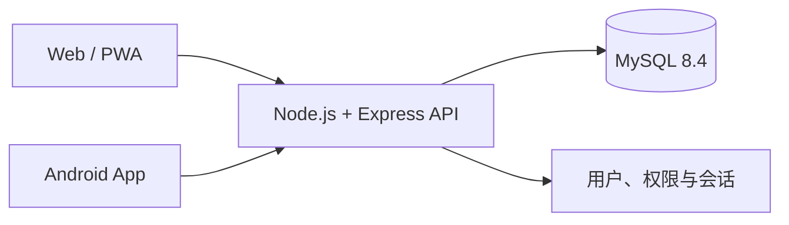

# Personal Workbench · 个人工作台

> 一个可自行部署的个人效率系统：把任务、日程、Markdown 笔记、目标习惯、统计复盘和专注工具放进同一个工作台，并在 Web 与 Android 之间共享数据。


Personal Workbench 面向希望掌控个人数据、又不想在多个应用之间来回切换的用户。它既可以部署在自己的 Linux 服务器上通过浏览器使用，也可以构建为 Android App；两端连接同一套 Node.js API 和 MySQL 数据。

## 为什么选择它

- **一体化工作流**：任务、日程、笔记、目标与复盘互相关联，不再散落在不同工具中。
- **自然语言快速录入**：输入“明天 18 点前 重要紧急 完成需求文档 #工作”，自动识别时间、四象限和标签。
- **多种任务视图**：列表、分组、看板和甘特图按场景切换。
- **自托管数据**：业务数据保存在自己的 MySQL 中，支持 JSON 备份与恢复。
- **Web + Android**：响应式 Web、PWA 与 Capacitor Android 工程共用核心功能。
- **适合长期维护**：Docker 部署、健康检查、升级前备份和失败自动回滚均已覆盖。

## 功能概览

| 模块 | 主要能力 |
| --- | --- |
| 工作台 | 今日概览、待办清单、日程时间轴、最近笔记、专注统计 |
| 任务 | 自然语言录入、四象限、子任务、批量操作、重复任务、看板、甘特图 |
| 日程 | 日/周/月视图、拖拽调整、冲突检测、重复日程、系统提醒 |
| 笔记 | Markdown 编辑、自动保存、文件夹与标签、全文检索、任务/日程双链 |
| 统计 | 完成率与延期率、分类分布、趋势图、周报/月报、Markdown 导出 |
| 工具箱 | 番茄钟、日期计算器、单位与汇率换算、常用收藏夹 |
| 目标与习惯 | 周/月/季度/年度目标、关键结果、任务关联、习惯打卡与连续统计 |
| 多用户管理 | 管理员与普通用户、数据隔离、账号停用、密码重置、会话强制下线 |

## 系统架构



生产环境由 Nginx 提供 Web 静态资源并反向代理 `/api`。Android App 通过 HTTPS 连接同一 API，因此浏览器和手机看到的是同一份数据。

## 快速开始

### 使用 Docker Compose

环境要求：Docker Engine 24+、Docker Compose v2。

```bash
git clone https://github.com/zhangzihe3-hub/personal-workbench.git
cd personal-workbench
cp .env.example .env
```

编辑 `.env`，至少替换以下配置中的示例值：

```dotenv
MYSQL_PASSWORD=请设置随机强密码
MYSQL_ROOT_PASSWORD=请设置另一个随机强密码
ADMIN_PASSWORD=请设置管理员登录密码
TOKEN_SECRET=请设置至少32位的随机字符串
```

使用 Compose 自带的 MySQL 启动完整服务：

```bash
docker compose --profile bundled-db up -d --build
docker compose ps
curl http://127.0.0.1:8080/api/health
```

浏览器打开 `http://localhost:8080`，使用 `.env` 中的 `ADMIN_USERNAME` 和 `ADMIN_PASSWORD` 登录。

如果服务器已经安装 MySQL，可以不启用 `bundled-db` profile，并在 `.env` 中配置对应的数据库地址。生产环境的域名、HTTPS、备份和升级说明请参阅[部署文档](docs/部署说明.md)。

> [!IMPORTANT]
> 生产模式检测到示例密码时，API 会拒绝启动。不要提交 `.env`、数据库备份、签名文件或真实凭据。

## Android App

Android 工程基于 Capacitor 8，支持本地通知、文件分享和移动端布局。构建环境需要 Node.js 22+、Android Studio 2025.2.1+ 和 Android SDK。

```bash
npm install
npm run android:sync
npm run android:open
```

随后在 Android Studio 中生成签名 APK 或 AAB。App 首次启动时需要填写部署好的 HTTPS API 地址，例如 `https://workbench.example.com/api`。完整步骤见 [Android 构建说明](docs/Android构建说明.md)。

## 本地开发

先准备一个可访问的 MySQL 数据库并配置环境变量，然后分别启动 API 与前端：

```bash
npm install
npm run dev:server
npm run dev
```

Vite 默认把 `/api` 代理到 `http://127.0.0.1:3000`，也可以通过 `VITE_DEV_API_TARGET` 指定其他地址。

### 常用命令

| 命令 | 用途 |
| --- | --- |
| `npm run dev` | 启动 Vite 开发服务器 |
| `npm run dev:server` | 监听文件变化并启动 API |
| `npm test` | 运行 Vitest 测试 |
| `npm run build` | 构建 Web 生产版本 |
| `npm run android:sync` | 构建 Web 并同步到 Android 工程 |
| `npm run android:open` | 在 Android Studio 中打开工程 |

## 项目结构

```text
personal-workbench/
├─ src/                 Vue 前端、组件、状态与业务逻辑
├─ server/              Express API、认证和 MySQL 数据访问
├─ android/             Capacitor Android 原生工程
├─ deploy/              Dockerfile、Nginx、升级和回滚脚本
├─ docs/                使用、部署、数据格式与构建文档
├─ tests/               前端工具函数与服务端测试
├─ docker-compose.yml   Web、API 与可选 MySQL 编排
└─ .env.example         环境变量示例
```

## 数据与安全

- 每个用户的数据按 `owner` 字段隔离，密码使用独立盐值哈希保存。
- 登录会话可查看并强制下线；管理员可以停用账号和重置密码。
- 应用内支持带密码加密的 JSON 导出与覆盖式恢复。
- Android 正式使用时应连接可信 HTTPS 地址，不建议在公共网络使用明文 HTTP。
- 使用内置 MySQL 时请同时备份 `mysql_data` 卷；不要执行 `docker compose down -v`。

## 文档

- [完整使用说明](docs/使用说明.md)
- [Linux 部署与运维](docs/部署说明.md)
- [Android 构建说明](docs/Android构建说明.md)
- [数据格式说明](docs/数据格式说明.md)

## 参与项目

如果你发现问题或有功能建议，欢迎提交 [Issue](https://github.com/zhangzihe3-hub/personal-workbench/issues)。在提交 Pull Request 前，请先运行：

```bash
npm test
npm run build
```

如果这个项目对你有帮助，欢迎点一个 **Star**。你的反馈也会帮助它继续改进。
